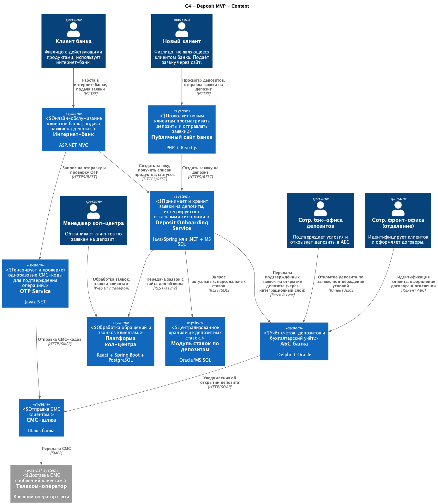

### **Название задачи:** 
MVP открытия депозитов онлайн (сайт и интернет‑банк) в банке «Стандарт»

### **Автор:**
Команда цифровой трансформации розничного бизнеса

### **Дата:**
27.11.2025

### **Функциональные требования**
Верхнеуровневые Use Cases:

|**№**|**Действующие лица или системы**|**Use Case**|**Описание**|
| :-: | :- | :- | :- |
| UC1 | Новый клиент, Сайт, Backend депозитов | Подача заявки на депозит с сайта | 1) Новый клиент открывает сайт банка и просматривает список депозитов с актуальными ставками. 2) Клиент выбирает депозит и заполняет форму (Ф.И.О., номер телефона, при необходимости сумма/срок). 3) Сайт передает данные в backend депозитов по защищённому каналу (HTTPS/TLS). 4) Backend депозитов сохраняет заявку в базе, присваивает идентификатор и формирует запись для системы кол-центра. 5) Клиент видит подтверждение, что заявка принята и с ним свяжется менеджер. |
| UC2 | Менеджер кол-центра, Система кол-центра, Backend депозитов | Обработка заявки на депозит с сайта | 1) Менеджер кол-центра в своей системе видит новые заявки на депозит, полученные из backend депозитов. 2) Менеджер изучает заявку, при необходимости предлагает клиенту особые условия. 3) По итогам общения менеджер фиксирует согласованные условия и результат (прийти в отделение, отказ и т.п.) в системе кол-центра. |
| UC3 | Новый клиент, Отделение, АБС | Идентификация нового клиента и открытие депозита | 1) После звонка из кол-центра клиент приходит в отделение для идентификации. 2) Сотрудник фронт-офиса идентифицирует клиента и заводит его в АБС (если ранее не был клиентом). 3) Сотрудник фронт-офиса в АБС создаёт депозитный договор с согласованными условиями. 4) Клиент подписывает договор, документы загружаются в АБС. 5) АБС проводит операции по открытию депозита и инициирует СМС-уведомление клиенту. |
| UC4 | Клиент‑физлицо (существующий), Интернет‑банк, Backend депозитов | Подача заявки на депозит в интернет‑банке | 1) Клиент авторизуется в интернет‑банке. 2) Интернет‑банк запрашивает у backend депозитов список доступных депозитов и персональные ставки клиента. 3) Клиент выбирает продукт, счёт списания и сумму депозита. 4) Интернет‑банк отправляет запрос на создание заявки в backend депозитов. 5) Backend депозитов валидирует заявку, создаёт запись в своей базе и возвращает данные для подтверждения (сумма, ставка, срок). |
| UC5 | Клиент, Интернет‑банк, СМС‑шлюз, Сервис OTP | Подтверждение заявки на депозит СМС‑кодом | 1) Для заявки из UC4 интернет‑банк инициирует отправку одноразового СМС‑кода через сервис OTP (реализованный поверх существующего СМС‑шлюза). 2) Сервис OTP генерирует код, сохраняет его и отправляет через СМС‑шлюз клиенту. 3) Клиент вводит СМС‑код в форме интернет‑банка. 4) Интернет‑банк передает введенный код в сервис OTP для проверки. 5) В случае успешной проверки backend депозитов переводит заявку в статус «подтверждена клиентом». |
| UC6 | Менеджер бэк‑офиса депозитов, АБС, Backend депозитов | Обработка онлайн‑заявки и открытие депозита (MVP) | 1) Менеджер бэк‑офиса депозитов в АБС или отдельном рабочем месте видит список подтверждённых заявок из backend депозитов. 2) Менеджер проверяет параметры, при необходимости согласует спецставку по текущему процессу. 3) Менеджер вручную создаёт депозитный договор в АБС или подтверждает его создание через интеграцию. 4) АБС открывает депозит и проводит операции. 5) АБС инициирует СМС‑уведомление клиенту об окончательной ставке и успешном открытии депозита. 6) Информация о результатах (номер договора, ставка, дата открытия) передаётся обратно в backend депозитов для отображения в ИБ. |
| UC7 | Сотрудники бэк‑офиса депозитов и кредитов, АБС / сервис ставок | Поддержка и использование справочника ставок по депозитам | 1) Сотрудник бэк‑офиса депозитов или кредитов открывает модуль управления ставками в АБС или отдельном сервисе ставок. 2) Сотрудник обновляет параметры ставок (базовые, спецставки, период действия, условия). 3) Система сохраняет новые ставки в Oracle/MS SQL. 4) Backend депозитов и интернет‑банк получают актуальные ставки (и персональные ставки клиента) из централизованного хранилища ставок. |
| UC8 | Клиент, Интернет‑банк, Backend депозитов | Просмотр статусов заявок и открытых депозитов | 1) Клиент в интернет‑банке открывает раздел «Мои депозиты / Заявки». 2) Интернет‑банк запрашивает у backend депозитов список заявок и их статусы, а также данные об открытых депозитах (часть может приходить из АБС через интеграцию). 3) Клиент видит актуальный статус (например, «ожидает обработки», «открыт», «отказано»). |

### **Нефункциональные требования**
Нефункциональные требования и архитектурно значимые требования:

|**№**|**Требование**|
| :-: | :- |
| NFR1 | Все взаимодействия сайта и интернет‑банка с backend должны выполняться по защищённому каналу (HTTPS/TLS), особенно при передаче персональных и паспортных данных. |
| NFR2 | Хранение чувствительных данных только на серверной стороне в защищённых базах данных (Oracle/MS SQL) с ограниченным доступом и аудитом. |
| NFR3 | Среднее время отклика интерфейсных операций (загрузка списка депозитов, отправка заявки, проверка статуса) не более 200–300 мс при нормальной нагрузке. |
| NFR4 | Интерфейсы сайта и интернет‑банка должны соответствовать дизайн‑системе банка и быть удобными для возрастной аудитории. |
| NFR5 | Доступность интернет‑банка и сервисов подачи заявок — не ниже 99,9% (с учётом резервного ЦОД и балансировки). |
| NFR6 | Сервисы приёма и хранения заявок на депозиты должны работать 24/7 и не зависеть от доступности АБС. |
| NFR7 | Взаимодействие с АБС должно быть вынесено в отдельный интеграционный слой и по возможности асинхронно, чтобы не увеличивать онлайн‑нагрузку на АБС. |
| NFR8 | Новые сервисы (backend депозитов, сервис OTP, сервис ставок) должны быть stateless и поддерживать горизонтальное масштабирование. |
| NFR9 | Предпочтительно использовать уже существующие технологии банка — Oracle и MS SQL для БД, Java/Spring или .NET для backend, React/ASP.NET/PHP для фронтенда. |
| NFR10 | При использовании очередей сообщений следует ориентироваться на Kafka как целевую платформу, но без прямой интеграции из текущей версии интернет‑банка. |
| NFR11 | Все новые сервисы и API должны быть документированы (OpenAPI/Swagger, схемы, описания Use Cases) для дальнейшего расширения функциональности (кредиты и др.). |
| NFR12 | Все операции по подаче заявок, подтверждению СМС‑кодом, изменениям статусов и открытию депозитов должны логироваться с возможностью end‑to‑end трассировки. |
| NFR13 | Необходимо учитывать ограничение по нагрузке на АБС (вертикальное масштабирование, перегруженная БД); прямые online‑запросы из интернет‑банка должны быть исключены. |
| NFR14 | Архитектура депозитов должна быть спроектирована так, чтобы её подходы можно было переиспользовать при цифровизации кредитов. |

### **Решение**
Диаграммы контекста и контейнеров в модели C4.

**Краткое текстовое описание решения**

1. **Каналы взаимодействия с клиентом.**  
   Сайт и интернет‑банк остаются основными фронтенд‑каналами для новых и существующих клиентов. Логика работы с заявками на депозиты выносится в отдельный backend депозитов, чтобы уменьшить связность и зависимость от монолита интернет‑банка и АБС.

2. **Backend депозитов (Deposit Onboarding Service).**  
   Новый сервис принимает заявки от сайта и интернет‑банка, хранит их в собственной БД (MS SQL), интегрируется:
   - с системой кол‑центра (передача заявок с сайта),
   - с АБС (передача подтверждённых заявок для открытия депозита),
   - с модулем ставок (получение актуальных ставок и вычисление персональных ставок).
   Сервис предоставляет единое API для обоих каналов и служит точкой консолидации логики по депозитам.

3. **Сервис OTP / подтверждения СМС.**  
   Для подтверждения заявок в интернет‑банке используется отдельный сервис OTP, реализованный силами банка поверх существующего СМС‑шлюза. Это позволяет не дорабатывать ядро интернет‑банка, управляемое подрядчиком, и при этом реализовать требуемую безопасность операций.

4. **Централизация ставок.**  
   Табличные XLS‑файлы заменяются централизованным модулем ставок (в АБС или отдельным сервисом ставок). Бэк‑офис депозитов и кредитов управляет ставками через этот модуль, а backend депозитов и интернет‑банк используют его как единственный источник истины по ставкам.

5. **Интеграция с АБС.**  
   Прямые online‑запросы из интернет‑банка в АБС не используются. Взаимодействие реализуется через:
   - backend депозитов, который формирует «подтверждённые» заявки;
   - интеграционный слой или задачи для бэк‑офиса, который создаёт депозиты в АБС по этим заявкам.
   Это разгружает АБС и снижает риски влияния фронтов на критичный учетный контур.

6. **Отказоустойчивость и масштабируемость.**  
   Новые сервисы проектируются stateless с возможностью горизонтального масштабирования и развёртывания в основном и резервном ЦОД. Балансировка позволяет со временем достигнуть целевой доступности 99,9% для контуров приема заявок и интернет‑банка.

7. **Подготовка к расширению на кредиты.**  
   Архитектурные принципы (единый backend для заявок, отдельный сервис OTP, централизованные справочники ставок, асинхронная интеграция с АБС) закладываются сразу с учетом последующего распространения на кредитные продукты.

### **Альтернативы**
Альтернативные решения:

1. **Прямая интеграция сайта и интернет‑банка с АБС.**  
   Сайт и ИБ непосредственно вызывают API/БД АБС для получения ставок и открытия депозитов.  
   *Плюсы:* минимальное количество новых компонентов.  
   *Минусы:* резкое увеличение online‑нагрузки на АБС, риски для устойчивости базового учета, сложность масштабирования (АБС масштабируется только вертикально).

2. **Реализация всей логики депозитов внутри монолита интернет‑банка.**  
   Все функции (заявки, ставки, статусы, интеграции) добавляются в существующий ASP.NET‑монолит.  
   *Плюсы:* меньше интеграций, можно использовать уже имеющийся код.  
   *Минусы:* усиление связности, зависимость от подрядчика ИБ, усложнение сопровождения и невозможность использовать это как универсальный шаблон для всех продуктов.

3. **Использование платформы кол‑центра как единого backend для депозитов.**  
   Заявки с сайта и ИБ обрабатываются через микросервисную платформу кол‑центра.  
   *Плюсы:* готовая микросервисная архитектура.  
   *Минусы:* платформа кол‑центра изначально не предназначена для продуктовой логики, что приводит к размыванию ответственности и высокой зависимости от подрядчика кол‑центра.

**Недостатки, ограничения, риски**

1. В рамках MVP значительная часть операций (подтверждение условий и открытие депозита в АБС) остаётся ручной задачей бэк‑офиса. Это ограничивает масштаб и скорость обработки заявок.
2. Появляется несколько новых сервисов и интеграций (backend депозитов, OTP, модуль ставок, интеграционный слой с АБС), что повышает сложность ландшафта и требования к DevOps‑процессам, мониторингу и поддержке.
3. Асинхронная интеграция между backend депозитов и АБС создаёт риск временной несогласованности данных (заявка подтверждена клиентом, но ещё не обработана АБС); требуется продуманный механизм синхронизации и обработки ошибок.
4. При росте онлайн‑нагрузки увеличится нагрузка на СМС‑шлюз, телеком‑оператора и систему кол‑центра, что потребует дополнительных мер масштабирования и контроля SLA.
5. Возможен технологический «зоопарк», если не стандартизировать стеки и подходы (логирование, мониторинг, CI/CD) для новых сервисов.
