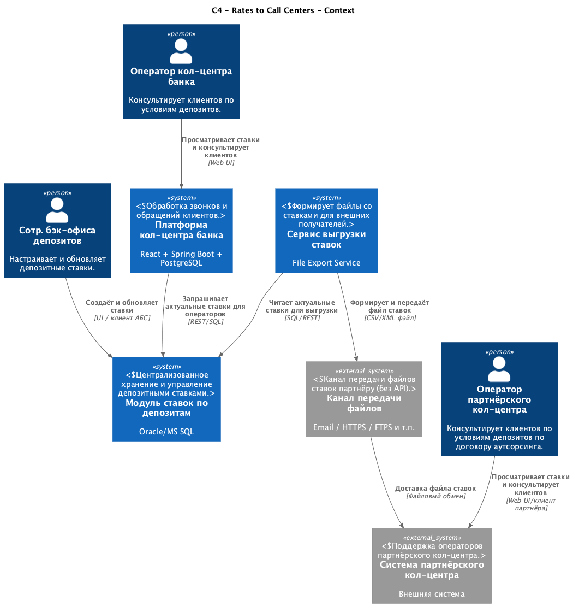
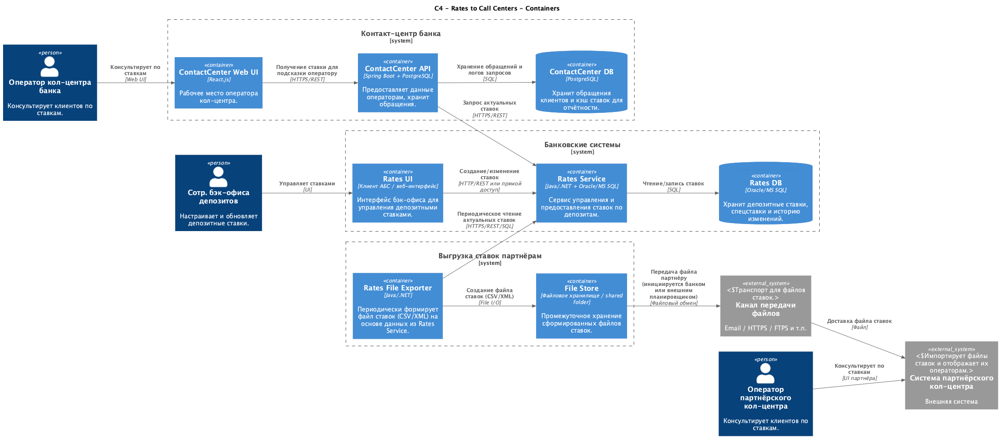

# ADR: Передача ставок в кол-центр и партнёрский кол-центр

## Название задачи
Передача депозитных ставок в контактный центр банка и внешний партнёрский кол-центр

## Автор
Команда цифровой трансформации розничного бизнеса

## Дата
2025-11-27

## Функциональные требования (Use Cases)

| № | Действующие лица или системы | Use Case | Описание |
|---|------------------------------|----------|-----------|
| 1 | BackOfficeDep → RatesModule | UC1: Управление ставками | Сотрудники бэк-офиса обновляют депозитные ставки в централизованном модуле ставок |
| 2 | ContactCenterPlatform | UC2: Просмотр ставок | Сотрудник CC должен видеть актуальные ставки в интерфейсе |
| 3 | DepositBackend → CC API | UC3: Передача ставок | Backend предоставляет ставки в CC через REST |
| 4 | RatesModule → FileExporter | UC4: Генерация файла ставок | Генерация CSV/XML файла для партнёрского кол-центра |
| 5 | FileDistributor → PartnerCC | UC5: Передача файла | Отправка файла партнёру по доступному каналу |
| 6 | PartnerCC | UC6: Просмотр ставок | Партнёрский CC отображает ставки у себя |

## Нефункциональные требования

| № | Требование |
|---|------------|
| 1 | Доступность: 99.9% |
| 2 | Не нагружать АБС — ставки не должны вычисляться в АБС |
| 3 | Быстродействие: выдача ≤ 200 мс |
| 4 | Удобный интерфейс для возрастных операторов |
| 5 | Обновление ежедневно автоматически |
| 6 | Для партнёра — только файл |
| 7 | Аудит всех передач |

## Решение

Диаграммы:

## Обоснование
- Ставки централизуются в RatesModule (Oracle/MS SQL)
- CC получает ставки через REST (низкая задержка)
- Партнёр — только файл, потому FileExporter + FileDistributor
- Исключаем нагрузку на АБС

## Альтернативы
1. API для партнёра — недоступно  
2. Прямая репликация БД — небезопасно  
3. Kafka — слишком сложный для MVP

## Риски
- Ошибки ставок → массовые ошибки консультаций
- Сбой выгрузки файла → устаревшие данные
- Требуется уведомление о неудачных выгрузках

