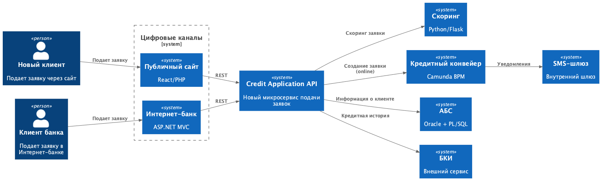
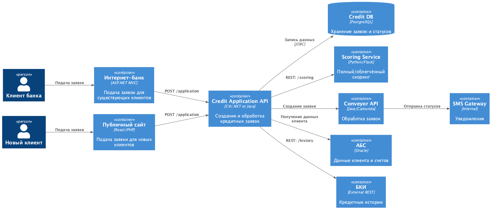

# ADR: Онлайн‑подача кредитной заявки

## 1. Контекст
Банк «Стандарт» развивает кредитный процесс и планирует обеспечить подачу кредитной заявки онлайн как для новых клиентов (через сайт), так и для существующих (через интернет‑банк).  
Цель — ускорить процесс предварительного решения, минимизировать нагрузку на АБС, обеспечить работу 24/7, защиту данных и целостность интеграций.

## 2. Use Cases

### UC‑1. Новый клиент подаёт заявку на сайте
**Акторы:** Новый клиент, Публичный сайт, Credit Application API  
**Сценарий:**
1. Клиент вводит данные (ФИО, телефон, паспорт — опц.).
2. Выполняется облегчённый скоринг (БКИ).
3. Клиент получает предварительное решение.
4. Создаётся кредитная заявка.
5. Клиент получает SMS о необходимости визита в офис.

### UC‑2. Клиент банка подаёт заявку в интернет‑банке
**Акторы:** Клиент банка, Интернет‑банк, Credit Application API  
**Сценарий:**
1. Клиент выбирает параметры кредита.
2. Выполняется полный скоринг (БКИ + АБС + история).
3. Операция подтверждается SMS‑кодом.
4. Создаётся заявка и отправляется в Кредитный конвейер.
5. Сотрудники принимают финальное решение.

### UC‑3. Предодобренные предложения
1. Система рассчитывает лимиты оффлайн.
2. Клиент видит предодобрение.
3. При подаче заявки выполняется упрощённая проверка.
4. Заявка попадает в ускоренный процесс.

### UC‑4. Уведомления клиенту
1. Конвейер меняет статус заявки.
2. Credit API отправляет уведомления в SMS‑шлюз.
3. Клиент получает SMS о ключевых статусах.

## 3. Функциональные требования

### Интернет‑банк
- F1. Подача заявки.
- F2. Просмотр условий кредитов.
- F3. Подтверждение заявки через SMS.
- F4. Просмотр статуса заявки.
- F5. Работа с предодобренными предложениями.

### Публичный сайт
- F6. Минимальная форма заявки.
- F7. Облегчённый скоринг.
- F8. SMS‑уведомление.

### Backend / Credit Application API
- F9. Создание заявки.
- F10. Онлайн‑отправка в Конвейер.
- F11. Поддержка всех типов скоринга.
- F12. Ведение истории статусов.
- F13. Приём событий от Конвейера (webhook / MQ).

## 4. Нефункциональные требования

### Производительность
- N1. Скоринг ≤ 1.5 сек.
- N2. Ответ API ≤ 300 мс.

### Надёжность
- N3. Доступность 99.9%.
- N4. Защита от потери заявок при сбое АБС.

### Масштабируемость
- N5. Credit API — горизонтальное масштабирование.
- N6. Скоринг — ограничение нагрузки.

### Безопасность
- N7. TLS, WAF, аудит.
- N8. PDN‑compliance (152‑ФЗ).
- N9. SMS‑подтверждение операций.

## 5. Диаграммы 

## 6. Альтернативы

### A1. Интеграция через АБС напрямую
**Минусы:** нагрузка, отсутствие 24/7, риски блокировок → ❌ отклонено.

### A2. Использовать Кредитный конвейер как фронтовый API
**Минусы:** задержки, не предназначен для фронта → ❌ отклонено.

### A3. Выделить Credit Application API
**Плюсы:** масштабируемость, снижение нагрузки на АБС, единая точка входа → ✅ выбрано.

## 7. Ограничения решения
- АБС масштабируется только вертикально.
- Нагрузка на скоринг ограничена.
- БКИ ограничивает количество API‑запросов.
- Нельзя использовать Kafka в текущей версии ИБ.
- SMS‑канал не гарантирует мгновенность.

